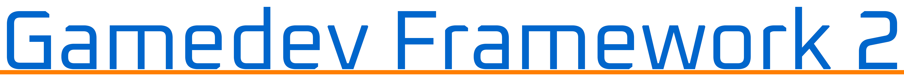

# Gamedev Framework 2

**Gamedev Framework 2** (gf2) is a modern framework to build 2D games in C++17. It is based on [SDL 3](https://libsdl.org/) and provides high-level constructions to easily build games.

> [!CAUTION]
> This project is in **alpha stage**. The API is not stabilized and may change during the development.
> You can use [Gamedev Framework 1](https://github.com/GamedevFramework/gf).

## Example

The following example illustrates how to draw a simple sprite.

```cc
#include <gf2/graphics/Scene.h>
#include <gf2/graphics/SceneManager.h>
#include <gf2/graphics/SpriteEntity.h>

int main()
{
  gf::SingleSceneManager scene_manager("my game", gf::vec(1600, 900));

  const gf::GpuTexture texture("logo.png", scene_manager.render_manager());
  gf::SpriteEntity sprite_entity(&texture, scene_manager.render_manager());
  sprite_entity.set_location({ 100.0f, 100.0f });
  sprite_entity.set_origin({ 0.5f, 0.5f });
  sprite_entity.set_scale(0.1f);

  gf::StandardScene scene;
  scene.set_world_center({ 100.0f, 100.0f });
  scene.set_world_size({ 200.0f, 200.0f });

  scene.add_world_entity(&sprite_entity);

  return scene_manager.run(&scene);
}
```

## Build status

[](https://github.com/GamedevFramework/gf2/actions/workflows/build.yml)

## License

Gamedev Framework 2 is licensed under the terms and conditions of the [zlib/libpng license](https://opensource.org/licenses/Zlib).
